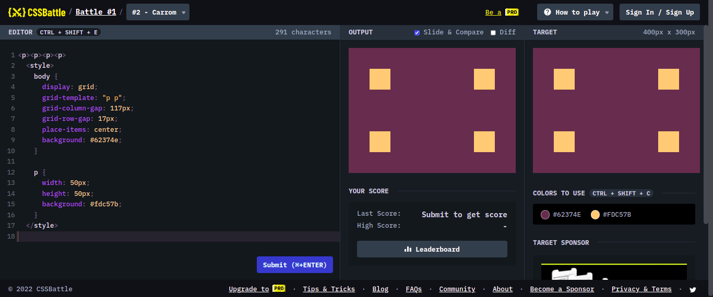

# Battle #1 - Pilot Battle

## #2 - Carrom

[Link del problema](https://cssbattle.dev/play/2)



```html
<p><p><p><p>
  <style>
    body {
      display: grid;
      grid-template: "p p";
      grid-column-gap: 117px;
      grid-row-gap: 17px;
      place-items: center;
      background: #62374e;
    }
    p {
      width: 50px;
      height: 50px;
      background: #fdc57b;
    }
  </style>
```
