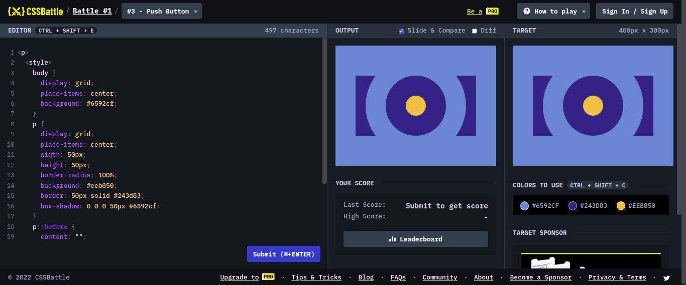

# Battle #1 - Pilot Battle

## #3 - Push Button

[Link del problema](https://cssbattle.dev/play/3)



```html
<p>
  <style>
    body {
      display: grid;
      place-items: center;
      background: #6592cf;
    }
    p {
      display: grid;
      place-items: center;
      width: 50px;
      height: 50px;
      border-radius: 100%;
      background: #eeb850;
      border: 50px solid #243d83;
      box-shadow: 0 0 0 50px #6592cf;
    }
    p::before {
      content: "";
      position: absolute;
      z-index: -1;
      width: 300px;
      height: 150px;
      background: #243d83;
    }
  </style>
```
