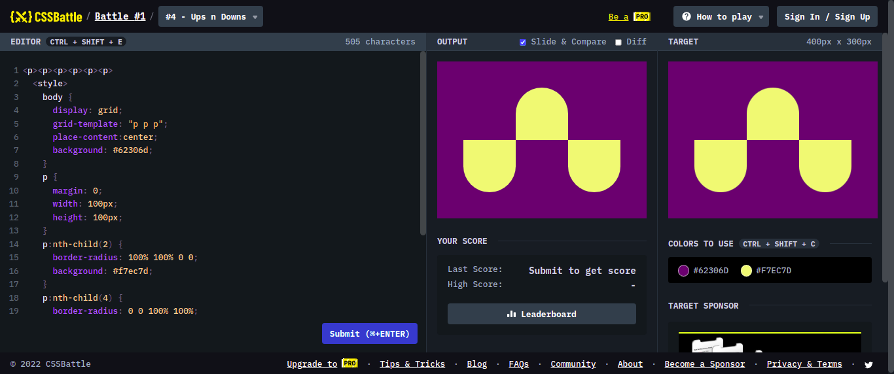

# Battle #1 - Pilot Battle

## #4 - Ups n Downs

[Link del problema](https://cssbattle.dev/play/4)



```html
<p><p><p><p><p><p>
  <style>
    body {
      display: grid;
      grid-template: "p p p";
      place-content: center;
      background: #62306d;
    }
    p {
      margin: 0;
      width: 100px;
      height: 100px;
    }
    p:nth-child(2) {
      border-radius: 100% 100% 0 0;
      background: #f7ec7d;
    }
    p:nth-child(4) {
      border-radius: 0 0 100% 100%;
      background: #f7ec7d;
    }

    p:nth-child(6) {
      border-radius: 0 0 100% 100%;
      background: #f7ec7d;
    }
  </style>
```
